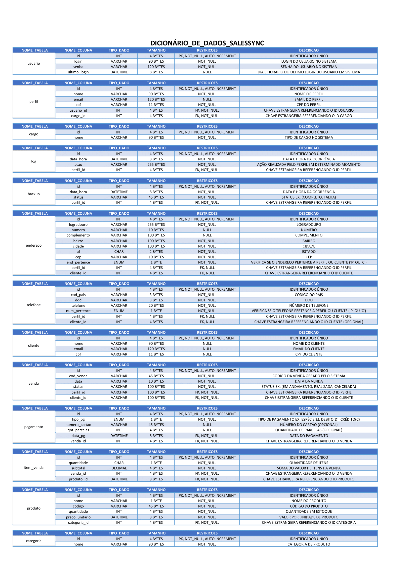

# SalesSync: Inventory Management System

## Overview
**SalesSync** is designed to meet the needs of small and medium-sized businesses that require a robust solution for managing their inventory and recording sales. The system allows users to:

### Features
- Product Management
- Sales Processing
- Detailed Reports
- Inventory Control

*Even when operating offline*, SalesSync has the capability to synchronize data with cloud servers, ensuring that information remains up-to-date and secure.

   
   
  
  

